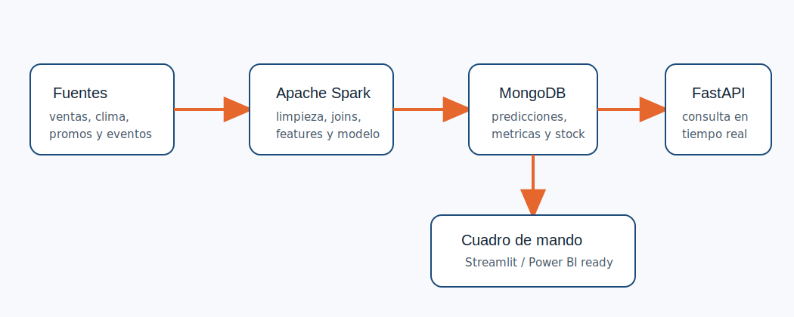

# Arquitectura del sistema SuperFresh

El sistema se ha planteado como una arquitectura Big Data sencilla y defendible:

1. **Fuentes de datos**: historico de ventas, clima, promociones y eventos externos.
2. **Procesamiento con Apache Spark**: limpieza, union de fuentes, variables temporales, lags, medias moviles y entrenamiento de modelos.
3. **Almacenamiento en MongoDB**: colecciones para metricas, predicciones y recomendaciones de stock.
4. **FastAPI**: endpoints REST para consumir los resultados en tiempo real.
5. **Cuadro de mando**: dashboard en Streamlit y ficheros preparados para Power BI/Tableau.

